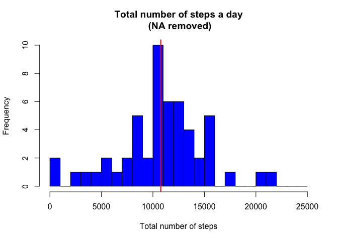
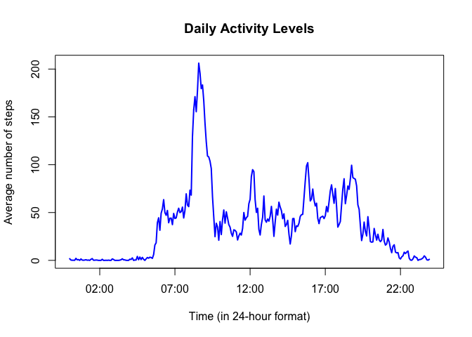
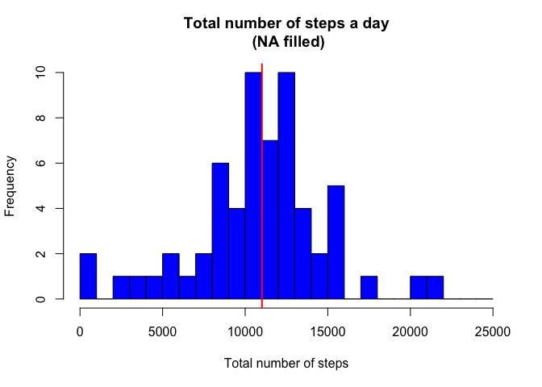
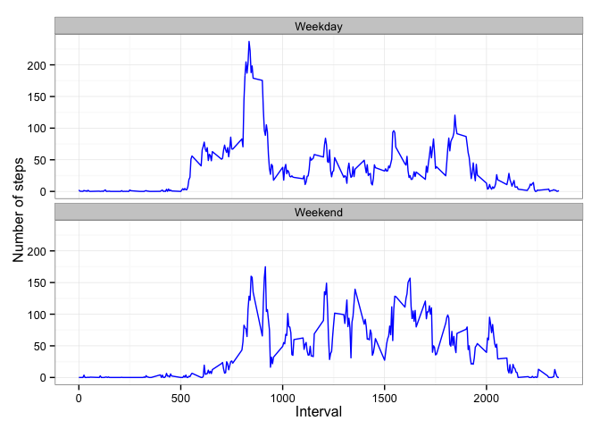

# Reproducible Research: Peer Assessment 1
Nikita Kirnosov  

## Introduction

It is now possible to collect a large amount of data about personal
movement using activity monitoring devices such as a
[Fitbit](http://www.fitbit.com), [Nike
Fuelband](http://www.nike.com/us/en_us/c/nikeplus-fuelband), or
[Jawbone Up](https://jawbone.com/up). These type of devices are part of
the "quantified self" movement -- a group of enthusiasts who take
measurements about themselves regularly to improve their health, to
find patterns in their behavior, or because they are tech geeks. But
these data remain under-utilized both because the raw data are hard to
obtain and there is a lack of statistical methods and software for
processing and interpreting the data.

This assignment makes use of data from a personal activity monitoring
device. This device collects data at 5 minute intervals through out the
day. The data consists of two months of data from an anonymous
individual collected during the months of October and November, 2012
and include the number of steps taken in 5 minute intervals each day.

## Data

The data for this assignment can be downloaded from the course web
site:

* Dataset: [Activity monitoring data](https://d396qusza40orc.cloudfront.net/repdata%2Fdata%2Factivity.zip) [52K]

The variables included in this dataset are:

* **steps**: Number of steps taking in a 5-minute interval (missing
    values are coded as `NA`)

* **date**: The date on which the measurement was taken in YYYY-MM-DD
    format

* **interval**: Identifier for the 5-minute interval in which
    measurement was taken; note that the interval value denotes 
    the start time of the interval, e.g. interval 1915 would mean
    that the data was collected between 7:15 and 7:20 pm.

The dataset is stored in a comma-separated-value (CSV) file and there
are a total of 17,568 observations in this
dataset.

## Loading and preprocessing the data

Let's start by cleaning up the environment and loading libraries

```r
rm(list=ls())
library("dplyr")
library("ggplot2")
```

Depending on what is already in the directory, download, unzip and/or read the file.

```r
fileURL <- "https://d396qusza40orc.cloudfront.net/repdata%2Fdata%2Factivity.zip"
fileZIP <- "activity.zip"
fileCSV <- "activity.csv"
if (!file.exists(fileZIP) & !file.exists(fileCSV)  ) {
        download.file(fileURL,destfile="fileZIP_test.zip",method="curl")
}
if (file.exists(fileZIP) & !file.exists(fileCSV)  ) {
        unzip(zipfile=fileZIP)
}
activity <- read.csv(fileCSV,stringsAsFactors=FALSE)
```

The only preprocessing step needed for now is to turn the date into POSIX format 

```r
activity$date <- as.POSIXct(activity$date, format="%Y-%m-%d")
```


## What is mean total number of steps taken per day?

For now, we will ignore NA values. 
Below the function which produces the histogram of the total number of steps
per day and calculates mean and median values for this distribution is shown. 


```r
TotNumSteps_hist <- function(data,hist_title="Total number of steps a day"){
        # aggregate data to produce the total number of steps on a specific date
        steps_tot_day <- aggregate(steps ~ date, data, sum, na.rm=TRUE)
        colnames(steps_tot_day) <- c("date","totsteps")
        # calculate mean and median
        mean   <- mean(steps_tot_day$totsteps, na.rm=TRUE)
        median <- median(steps_tot_day$totsteps, na.rm=TRUE)
        # draw a histogram
        hist(steps_tot_day$totsteps, 
             breaks=seq(from=0, to=25000,by=1000),
             col="blue", 
             xlab="Total number of steps", 
             main=hist_title)
        # draw median line
        abline(v = median,
         col = "red",
         lwd = 2)
        # clean up
        rm(steps_tot_day)
        # return a vector (mean, median)
        return(c(mean,median))
}
```

We can use this function on `activity` data set to produce

1. the required histogram

 

2. and find out that mean and median take the values of 10766.19 
and 10765, respectively. The median value is shown as a red vertical line
in the histogram above.

## What is the average daily activity pattern?

We will approach this question in the following way:

- create a data set which contains the mean (over all dates) values for each interval 


```r
mean_dt <- aggregate(steps ~ interval, activity, FUN="mean", na.rm=TRUE)
names(mean_dt) <- c("interval", "mean_steps")
```

- plot these values versus time corresponding to the intervals.

 

- we can also calculate the interval when the most steps is made (on average):


```r
max_steps <- max(mean_dt$mean_steps)
max <- mean_dt[ which(mean_dt$mean_steps == max_steps), 1]
```

Which brings us to a conclusion that the greatest number of steps 
(around 206) is made in the interval 835.


## Imputing missing values

The strategy for NA replacement is based on the assumption that activity 
levels depend on the day of the week and time of the day. Thus, we will
replace NA's with the average values for that specific time of the week.

To start with, let us add columns containing the day of the week and 
`Weekday`/`Weekend` label to the `activity` data frame.


```r
activity <- mutate(activity,weekday=weekdays(date), daytype= as.factor(ifelse(
        weekdays(date) %in% c("Saturday","Sunday"), "Weekend", "Weekday")))
```

Next, we create a data frame `mean_data` containing mean activity levels for
each pair of `interval` and `weekday` values:


```r
mean_data <- aggregate(steps ~ interval + weekday, activity,FUN="mean",na.rm=TRUE)
colnames(mean_data) <- c("interval","weekday","mean_steps")
```

Afterwards, we create a new column `mean_steps` and replace NAs with it's values.


```r
activity <- merge(activity,mean_data,by=c("weekday","interval"))
activity <- mutate(activity,steps = ifelse(is.na(steps), mean_steps , steps))
```

Once we have a corrected data set, we call the previously defined function 
`TotNumSteps_hist` for this data.


```r
c <- TotNumSteps_hist(activity,hist_title="Total number of steps a day\n (NA filled)")
```

 

Notice that the histogram had noticeably changed; so did the mean (10821.21) and 
median (11015) values.

## Are there differences in activity patterns between weekdays and weekends?

In order to answer this question, we will summarize the `activity` data by `daytype`
and plot the mean values for all intervals.


```r
activity <- activity %>% group_by(daytype, interval) %>% summarise(mean_steps = mean(steps))
ggplot(activity, aes(x=interval,
                     y=mean_steps)) + 
        geom_line(color="blue") + 
        facet_wrap(~ daytype, nrow=2, ncol=1) +
        labs(x="Interval", y="Number of steps") +
        theme_bw()
```

 

As one can see, there is a significant difference between two plots.
Weekdays are characterized by a high peak in the morning, while 
weekend activity is much more evenly distributed.


```r
rm(list=ls())
```
